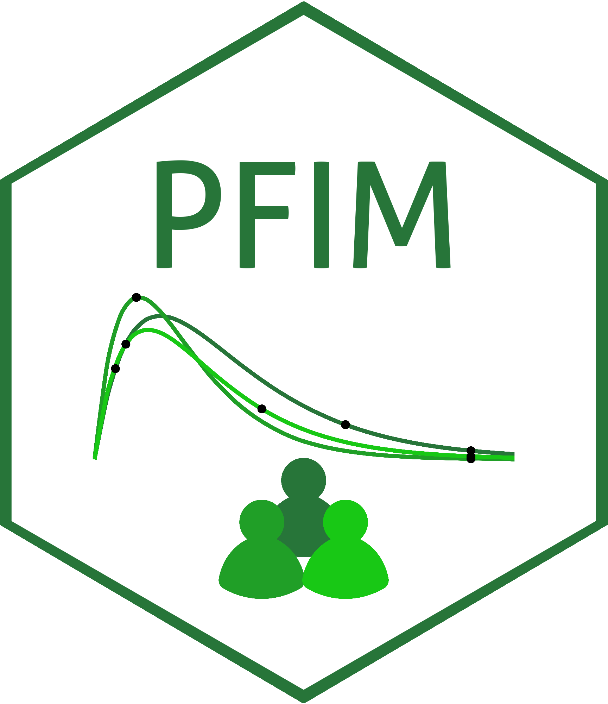

# PFIM 

[](https://cran.r-project.org/package=PFIM)
[](https://cran.r-project.org/package=PFIM)
[](https://www.gnu.org/licenses/gpl-3.0)

<p align="center">
  
</p>

## Overview

PFIM is an R package for evaluating and optimizing designs for nonlinear mixed effects models using the Fisher Information Matrix approach. The package provides comprehensive tools for population pharmacokinetic/pharmacodynamic (PK/PD) study design optimization.

**Key Features**
- **User script**: clear and intuitive
- **Model Library**: Pre-built PK/PD models for common scenarios.
- **Custom Models**: Support for user-defined analytical and ODE-based models.
- **Multiple optimization algorithms**: Various optimization methods for discrete and continuous optimization (PGBO, PSO, Simplex, Fedorov-Wynn, multiplicative algorithm)

The source code is modular, designed using a functional programming approach (via the package **purrr**) and R S7 object-oriented programming, which makes it easy to extend and customize your models and algorithms.

## Installation

```{r global_options, echo = FALSE, include = FALSE, eval =FALSE }
# Install from CRAN:
install.packages("PFIM")
# Load the package:
library(PFIM)
```

## Methodology

The methods implemented in PFIM are based on established research in optimal design theory:

- Mentré F, Mallet A, Baccar D (1997) <doi:10.1093/biomet/84.2.429>, 
- Retout S, Comets E, Samson A, Mentré F (2007) <doi:10.1002/sim.2910>, 
- Bazzoli C, Retout S, Mentré F (2009) <doi:10.1002/sim.3573>, 
- Le Nagard H, Chao L, Tenaillon O (2011) <doi:10.1186/1471-2148-11-326>, 
- Combes FP, Retout S, Frey N, Mentré F (2013) <doi:10.1007/s11095-013-1079-3> 
- Seurat J, Tang Y, Mentré F, Nguyen TT (2021) <doi:10.1016/j.cmpb.2021.106126>

## Package Information

Version: 7.0

I would like to inform you that the previous version 6.1 of the package is now deprecated and no longer maintained.  
Please upgrade to this version 7.0 for the new features of this version, including the new user script, please consult the NEWS file.

Author and creator: Romain Leroux <https://orcid.org/0009-0009-5779-5303> \[aut, cre\]

Author: France Mentré ORCID <https://orcid.org/0000-0002-7045-1275>
\[aut\]

Contributors: Jérémy Seurat <https://orcid.org/0000-0002-8127-7751> \[ctb\]

Maintainer: Romain Leroux \<romainlerouxPFIM@gmail.com\>

License: GPL-2 \| GPL-3 \[expanded from: GPL (≥ 3)\]

Logo designed by Lucie Fayette

## Design evaluation and optimization

Design evaluation and optimization examples have been implemented in PFIM 7.0. Source scripts are available in the folder Design_Evaluation/ and Design_Optimization/

- Design_Evaluation/
  - library_of_models
    - pk_analytic
    - pk_analytic_infusion
    - pk_analytic_infusion_pd_analytic
    - pk_analytic_infusion_pd_ode
    - pk_analytic_infusion_steady_state
    - pk_analytic_pd_analytic
    - pk_analytic_pd_ode
    - pk_analytic_steady_state
    - pk_analytic_steady_state_pd_analytic
  - user_defined_model
    - model_analytic
    - model_analytic_infusion
    - model_analytic_steady_state
    - model_ode_bolus
    - model_ode_dose_in_equations
    - model_ode_dose_not_in_equations
    - model_ode_infusion_dose_in_equations
- Design_Optimization
  - continuous/
    - PGBO
    - PSO
    - Simplex
  - discrete/
    - FedorovWynn/
    - MultiplicativeAlgorithm/

The Vignettes/ folder contains the two vignettes available on CRAN.

To run all the scripts, simply copy these folders to your computer and execute the run_examples_PFIM.R script.
Within this script, you need to specify the paths to the Design_Evaluation and Design_Optimization directories.

The Package documentation/ folder contains the complete documentation for all methods and classes included in the package.

## Getting help

If you encounter a clear bug, please file the issue with a minimal
reproducible example in the folder Issues.

For questions and other discussion, please use the PFIM group mailing
list: <thepfimgroup@googlegroups.com>
