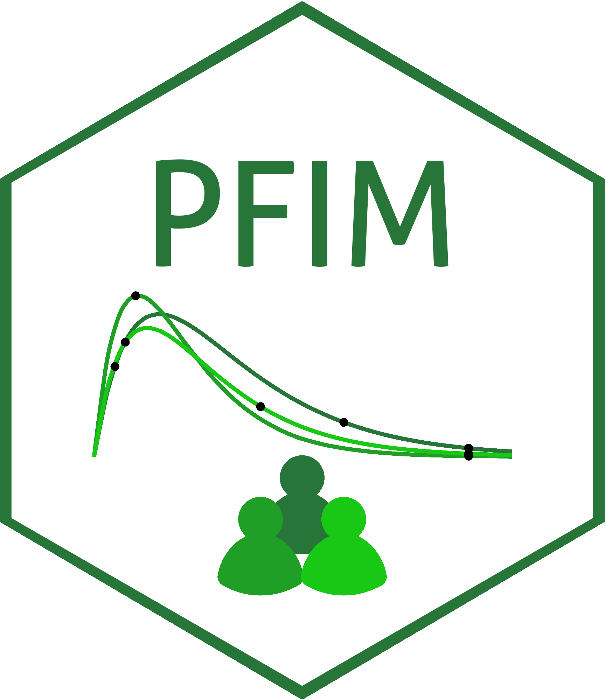

[](https://cran.r-project.org/package=PFIM)
[](https://cran.r-project.org/package=PFIM)
[](https://www.gnu.org/licenses/gpl-3.0)

<p align="center">
  
</p>

---

## Overview

PFIM is an R package for evaluating and optimizing designs for nonlinear mixed effects models using the Fisher Information Matrix approach. The package provides comprehensive tools for population pharmacokinetic/pharmacodynamic (PK/PD) study design optimization.

**Key Features**

- **User script**: clear and intuitive
- **Model Library**: pre-built PK/PD models for common scenarios
- **Custom Models**: support for user-defined analytical and ODE-based models
- **Multiple optimization algorithms**: various optimization methods for discrete and continuous optimization (PGBO, PSO, Simplex, Fedorov-Wynn, multiplicative algorithm)

The source code is modular, designed using a functional programming approach (via the R package **purrr**) and R S7 object-oriented programming, which makes it easy to extend and customize models and algorithms.

---

## Installation

```{r installation, echo=TRUE, eval=FALSE}
# Install from CRAN:
install.packages("PFIM")

# Load the package:
library(PFIM)
```

---

## Methodology

The methods implemented in PFIM are based on established research in optimal design theory:

- Mentré F, Mallet A, Baccar D (1997) <doi:10.1093/biomet/84.2.429>
- Retout S, Comets E, Samson A, Mentré F (2007) <doi:10.1002/sim.2910>
- Bazzoli C, Retout S, Mentré F (2009) <doi:10.1002/sim.3573>
- Le Nagard H, Chao L, Tenaillon O (2011) <doi:10.1186/1471-2148-11-326>
- Combes FP, Retout S, Frey N, Mentré F (2013) <doi:10.1007/s11095-013-1079-3>
- Seurat J, Tang Y, Mentré F, Nguyen TT (2021) <doi:10.1016/j.cmpb.2021.106126>

---

## Package Information

| Field | Details |
|---|---|
| **Version** | 7.0.3 |
| **License** | GPL-2 \| GPL-3 (≥ 3) |
| **Maintainer** | Romain Leroux — romainlerouxPFIM@gmail.com |

> **Note:** The previous version 6.1 is now deprecated and no longer maintained. Please upgrade to version 7.0.3 for new features, including the new user script. Consult the `NEWS.md` file for details.

**Authors**

- Romain Leroux — [ORCID 0009-0009-5779-5303](https://orcid.org/0009-0009-5779-5303) `[aut, cre]`
- France Mentré — [ORCID 0000-0002-7045-1275](https://orcid.org/0000-0002-7045-1275) `[aut]`
- Jérémy Seurat `[ctb]`

Logo designed by Lucie Fayette.

---

## Repository Structure

### S7 Classes — `R/`

The core of the package: all S7 classes and exported functions.

---

### Examples of Design Evaluation and Optimization

Design evaluation and optimization examples have been implemented in PFIM 7.0.3. Source scripts are available in the folders `Design_Evaluation/` and `Design_Optimization/`. To run all the scripts, simply copy these folders to your local machine and execute the `run_script_tests.R` script available at the root of the repository.

#### `Design_Evaluation/` — Design Evaluation Scripts

Organized into two categories:

**`library_of_models/`** — Evaluation examples using pre-built PK/PD models from the library:

| Script | Description |
|---|---|
| `pk_analytic` | Single or multi-compartment PK with bolus administration |
| `pk_analytic_infusion` | PK with intravenous infusion |
| `pk_analytic_infusion_pd_analytic` | Coupled PK/PD with infusion, both analytical |
| `pk_analytic_infusion_pd_ode` | Coupled PK/PD with infusion, PD defined by ODE |
| `pk_analytic_infusion_steady_state` | PK with infusion at steady state |
| `pk_analytic_pd_analytic` | Coupled PK/PD, both analytical |
| `pk_analytic_pd_ode` | Coupled PK/PD, PD defined by ODE |
| `pk_analytic_steady_state` | PK at steady state |
| `pk_analytic_steady_state_pd_analytic` | PK at steady state coupled with analytical PD |

**`user_defined_model/`** — Evaluation examples using custom user-defined models:

| Script | Description |
|---|---|
| `model_analytic` | User-defined analytical model |
| `model_analytic_infusion` | User-defined analytical model with infusion |
| `model_analytic_steady_state` | User-defined analytical model at steady state |
| `model_ode_bolus` | User-defined ODE model with bolus administration |
| `model_ode_dose_in_equations` | User-defined ODE model where dose appears explicitly in the equations |
| `model_ode_dose_not_in_equations` | User-defined ODE model where the dose does not appear explicitly in the equations but is handled through one of the ODE compartment variables  |
| `model_ode_infusion_dose_in_equations` | User-defined ODE model with infusion, dose in equations |

#### `Design_Optimization/` — Design Optimization Scripts

Split by optimization type:

**`continuous/`** — Optimization over continuous sampling times:

| Algorithm | Description |
|---|---|
| `PGBO` | Population Genetics-Based Optimization |
| `PSO` | Particle Swarm Optimization |
| `Simplex` | Nelder-Mead simplex method |

Continuous optimization supports extensible constraints on sampling times, defined through time windows: for each window, the user can specify a minimum and maximum bound, the number of sampling times within the window, and minimum intervals between consecutive samples.

**`discrete/`** — Optimization over a discrete grid of candidate times:

| Algorithm | Description |
|---|---|
| `FedorovWynn/` | Fedorov-Wynn point-exchange algorithm |
| `MultiplicativeAlgorithm/` | Classical multiplicative algorithm |

Discrete optimization supports constraints on both sampling times and doses, allowing the user to restrict the search to a pre-specified grid of candidate values for each.

---

### Vignettes — `Vignettes/`

The `Vignettes/` folder contains the vignettes available on CRAN, serving as structured tutorials for new users. They cover the two main use cases of the package:

- **Design evaluation** — how to assess the efficiency of a given sampling design using the FIM
- **Design optimization in the continuous case** — optimizing sampling times as continuous variables (PGBO, PSO, Simplex)
- **Design optimization in the discrete case** — selecting optimal designs from a pre-specified grid of candidate times (Fedorov-Wynn, multiplicative algorithm)

---

### Documentation — `Package documentation/`

The `Documentation/` folder contains the complete documentation for all methods and classes included in the package:

- **S7 classes** — definition and structure of all objects used in the package (models, designs, algorithms, results, etc.)
- **Generic methods** — description of all methods implemented for each class, including evaluation and optimization routines
- **Function references** — detailed documentation of all exported functions, their arguments, return values, and usage examples

This folder is the reference entry point for developers who want to understand the internal architecture of PFIM or extend it with new models and algorithms.

---

### Unit Tests — `tests/`

The `tests/` folder contains the unit test suite ensuring the correctness and reliability of the package:

- **Model evaluation** — verifying that the FIM computation gives the expected results for both analytical and ODE-based models
- **Regression tests** — ensuring that new developments do not break existing functionality across versions

---

## Getting Help

If you encounter a clear bug, please file an issue with a minimal reproducible example directly in the [Issues](https://github.com/packagePFIM/PFIM/issues) section of the GitHub repository. To help diagnose the problem efficiently, a good bug report should include:

- The version of PFIM and R being used
- A minimal, self-contained script that reproduces the issue
- The error message or unexpected output obtained

For questions, methodological discussions, or feature requests, please use the **PFIM group mailing list**: thepfimgroup@googlegroups.com
